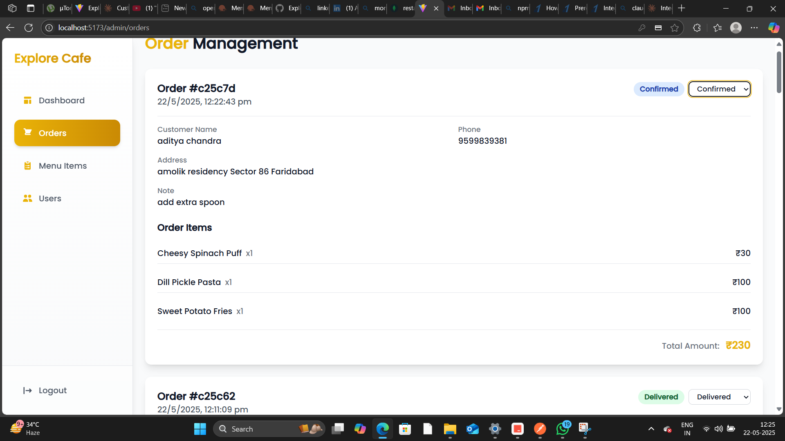

# 🍽️ Explore Cafe - Seamless Restaurant Management

Explore Cafe is your all-in-one solution for modern restaurant management, offering a smooth and intuitive experience for both customers and staff. Built with cutting-edge technologies, this platform streamlines everything from menu Browse and order placement to secure payments and user management, ensuring a delightful dining journey.

---

## ✨ Why Explore Cafe?

Explore Cafe is designed to elevate the restaurant experience with its robust features:

* **Effortless Order Management:** Customers can easily browse a comprehensive menu, add items to their cart, and track orders in real-time. With options for both cash and online payments, convenience is key.
* **Fortified Secure Payments:** Powered by **Razorpay**, Explore Cafe provides a secure and reliable payment gateway, supporting multiple payment methods and ensuring peace of mind with every transaction.
* **Personalized User Experience:** Users benefit from secure authentication, a detailed order history, easy profile management, and a dedicated feedback system, making every interaction personal and efficient.

---

## 📸 Application Screenshots

### 🏠 Homepage

Welcome to Explore Cafe - your gateway to delicious dining experiences.

### 🍽️ Menu Page

Browse our extensive menu with beautifully presented dishes.

### 👤 Admin Dashboard

Powerful admin controls for restaurant management.

### 👥 User Management

Efficient user management interface for administrators.

### 🛒 Shopping Cart

User-friendly cart interface for easy ordering.

### 💬 Feedback System

Collect valuable customer feedback to improve services.

### 📝 Order Process

Streamlined order placement interface.

### 📋 Order Summary

Detailed order summary for review.

### ✅ Order Completion

Confirmation page for successful orders.

### 💳 Payment Gateway

Secure payment processing with Razorpay integration.

### ✨ Payment Success

Payment confirmation and order success page.

### 👤 User Profile

Personalized user profile management.

### 📝 Sign Up

User-friendly registration process.

### ℹ️ About Us

        
## 🛠️ Tech Stack Spotlight

Explore Cafe leverages a powerful combination of technologies to deliver its seamless performance:

### Frontend
* **React.js**: For a dynamic and responsive user interface that adapts to any device.
* **Vite**: Ensures lightning-fast development, making the building process efficient and enjoyable.
* **Tailwind CSS**: Provides sleek, modern styling with a utility-first approach for beautiful designs.
* **Axios**: Facilitates smooth and efficient communication with the backend APIs.

### Backend
* **Node.js**: The robust server runtime handling all business logic and requests.
* **Express**: The flexible web framework that underpins the server, ensuring stability and scalability.
* **MongoDB**: The NoSQL database chosen for its flexibility and scalability in handling restaurant data.
* **Razorpay**: The integrated payment gateway that secures all online transactions.

---

## 🚀 Get Started in Minutes!

Ready to transform your restaurant operations? Here's how to get Explore Cafe up and running:

### Prerequisites
Make sure you have these installed:
* **Node.js** (v14 or higher)
* **MongoDB**
* A **Razorpay** account

### Installation

1.  **Clone the Repository**:
    ```bash
    git clone [your-repository-url]
    cd Explore-Cafe
    ```

2.  **Install Frontend Dependencies**:
    ```bash
    cd frontend
    npm install
    ```

3.  **Install Backend Dependencies**:
    ```bash
    cd backend
    npm install
    ```

4.  **Set Up Environment Variables**:
    Create a `.env` file in your `backend` directory and add:
    ```
    MONGODB_URI=your_mongodb_uri
    RAZORPAY_KEY_ID=your_razorpay_key_id
    RAZORPAY_KEY_SECRET=your_razorpay_key_secret
    PORT=4001
    ```

5.  **Start Development Servers**:

    **Backend**:
    ```bash
    cd backend
    npm start
    ```

    **Frontend**:
    ```bash
    cd frontend
    npm run dev
    ```

---

## 🔍 Your Usage Guide

Once everything's set up, here's how to navigate Explore Cafe:

* **Browse Menu**: Dive into the diverse menu, check out item details and prices, and easily add your favorites to the cart.
* **Place Order**: Review your selections, enter delivery information, pick your preferred payment method, and finalize your order with ease.
* **Track Order**: Stay updated with real-time order status and delivery updates, and access your complete order history whenever you need it.

---

## 👥 Meet the Developer

* **Aditya Chandra**: Lead Developer

---

## 📄 License

Explore Cafe is distributed under the **MIT License**. For more details, see the `LICENSE` file in the repository.

---

## 📞 Get in Touch!

Have questions or feedback? Reach out to Aditya Chandra at [adityachandra419@gmail.com].

---

**Made with ❤️ for Food Lovers**
